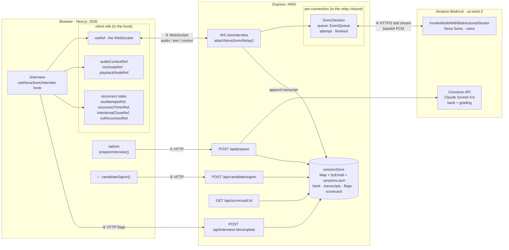
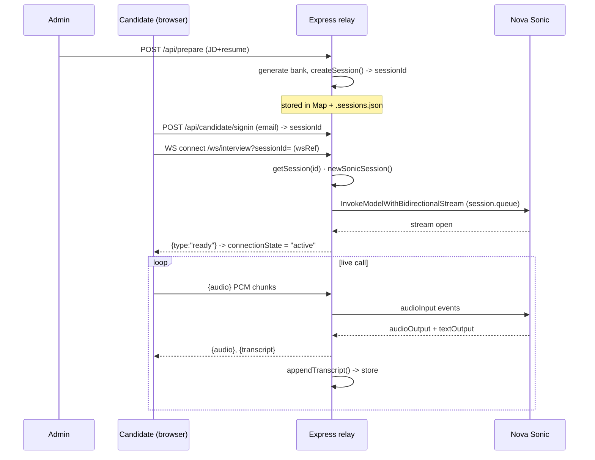
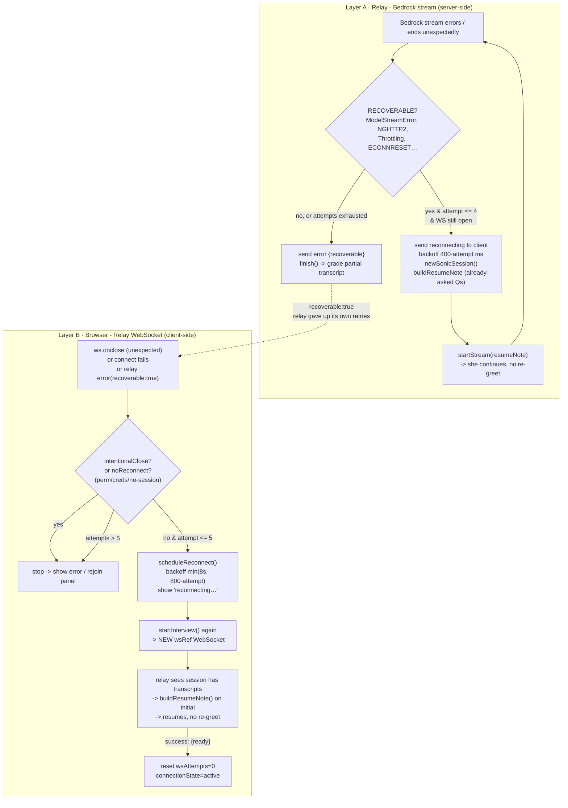

# Architecture — connections & reconnect

This document describes the **calling architecture** of the Round-0 interview
system: which connections exist, where each is stored, what happens when one
drops, and how each is retried.

There are **two independent connections** in the live voice path, each with its
own retry loop:

- **Browser ↔ Relay** — a **WebSocket** (`/ws/interview`), held client-side in
  `wsRef` inside `useNovaSonicInterview`.
- **Relay ↔ Bedrock** — the **Nova Sonic bidirectional stream**
  (`InvokeModelWithBidirectionalStream`), held server-side per-connection as
  `SonicSession.queue`.

Durable state (bank, transcripts, flags, scorecard) lives in `sessionStore`
(in-memory `Map` mirrored to `.sessions.json`), keyed by `sessionId`. The relay
appends the transcript as it streams, so it survives *both* connections dropping —
which is what makes a mid-interview reconnect resume instead of starting over.

---

## 1. Calling architecture — the two connections & where state lives

**Which connection / where stored:**

- **③ Browser ↔ Relay = a WebSocket.** Stored client-side in **`wsRef`** (inside
  `useNovaSonicInterview`). This is the only "connection" the browser holds.
- **④ Relay ↔ Bedrock = the Nova Sonic bidirectional stream.** Stored server-side
  per-connection as the **`SonicSession.queue`** (an `EventQueue` fed to
  `InvokeModelWithBidirectionalStream`). One WS connection → one live `SonicSession`.
- **Durable state** (bank, transcripts, flags, scorecard) lives in the
  **`sessionStore` Map** mirrored to `.sessions.json`, keyed by `sessionId`.

---

## 2. Connection setup (happy path)

---

## 3. What happens on a drop, and how we retry — two independent loops

**Retry rules:**

| Drop type | Detected by | Retries | Backoff | Resume? |
|---|---|---|---|---|
| Bedrock stream (recoverable) | relay `catch` | **4×** (`MAX_STREAM_ATTEMPTS`) | `400·attempt` ms | ✅ `buildResumeNote` |
| WebSocket drop / connect fail | client `ws.onclose` / catch | **5×** (`MAX_WS_RECONNECTS`) | `min(8s, 800·attempt)` | ✅ resumes on new WS |
| Relay exhausted its stream retries | relay sends `error{recoverable:true}` | → hands off to **Layer B** | — | ✅ |
| Creds / model-access / validation / no-session | `recoverable:false` | **never** (`noReconnectRef`) | — | — |
| User ended / hardware permission | `intentionalCloseRef` / `NotAllowedError` | **never** | — | — |

The two loops are decoupled on purpose: **Layer A** keeps the browser's WebSocket
alive while it re-establishes the Bedrock stream underneath; **Layer B** rebuilds
the WebSocket itself when *that* is what broke.

---

## Key files

| File | Role |
|---|---|
| `frontend/hooks/useNovaSonicInterview.ts` | WebSocket client (`wsRef`), audio worklets, **Layer B** reconnect (`scheduleReconnect`, `MAX_WS_RECONNECTS`) |
| `frontend/app/interview/page.tsx` | Interview room UI; reconnect overlay + Rejoin/End panel |
| `backend/src/novaSonic.ts` | Relay: `SonicSession`, `startStream`, **Layer A** reconnect (`RECOVERABLE`, `MAX_STREAM_ATTEMPTS`, `buildResumeNote`) |
| `backend/src/sessionStore.ts` | Durable `Map` + `.sessions.json` (bank, transcripts, flags, scorecard) |
| `backend/src/server.ts` | HTTP routes (`/api/prepare`, `/api/candidate/signin`, `/api/interview/:id/complete`, `/api/scorecard/:id`) |
